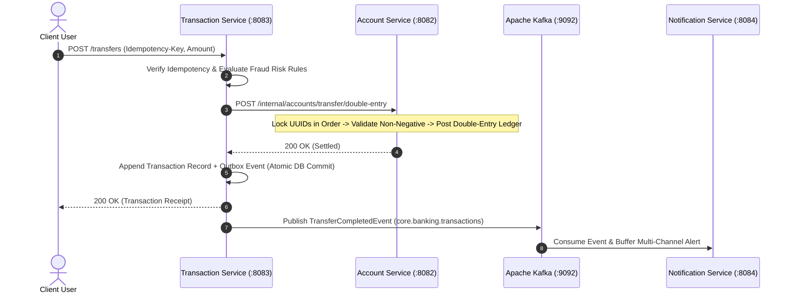
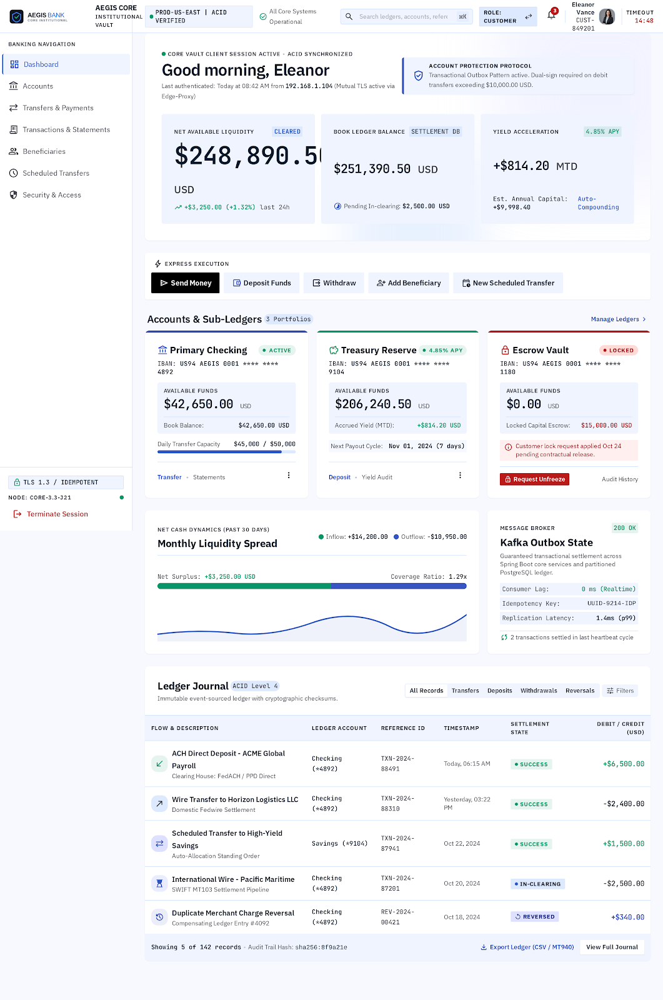
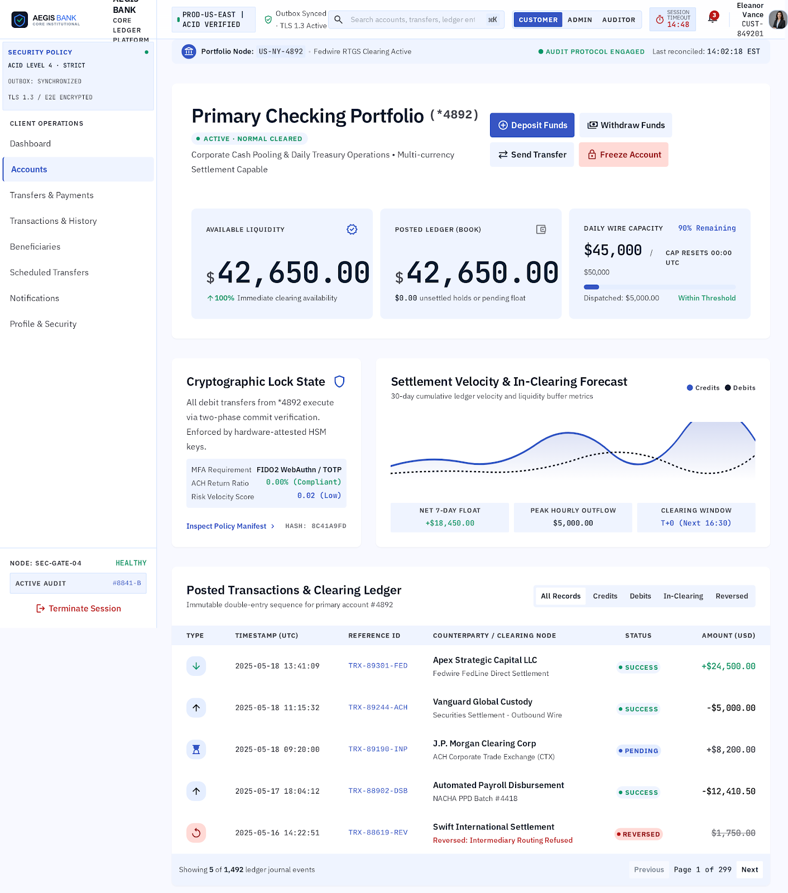
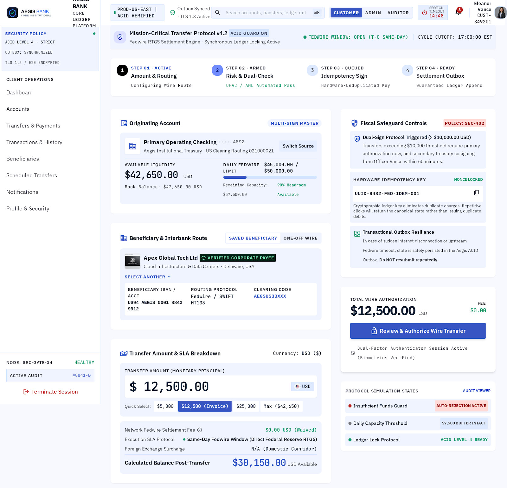
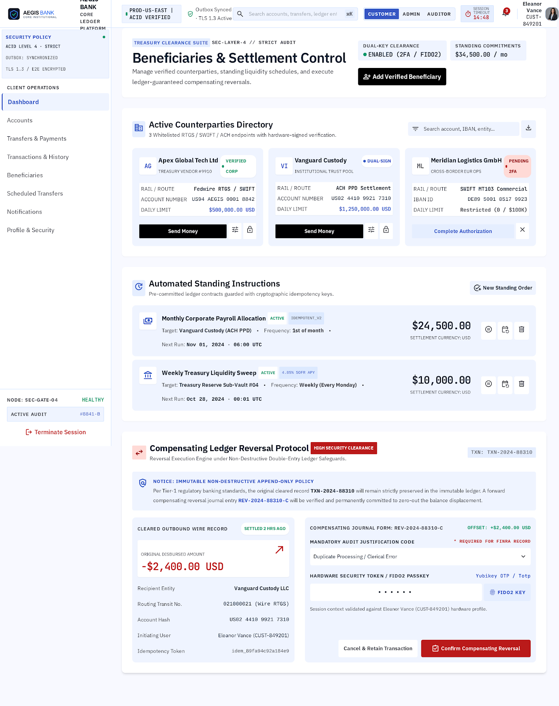
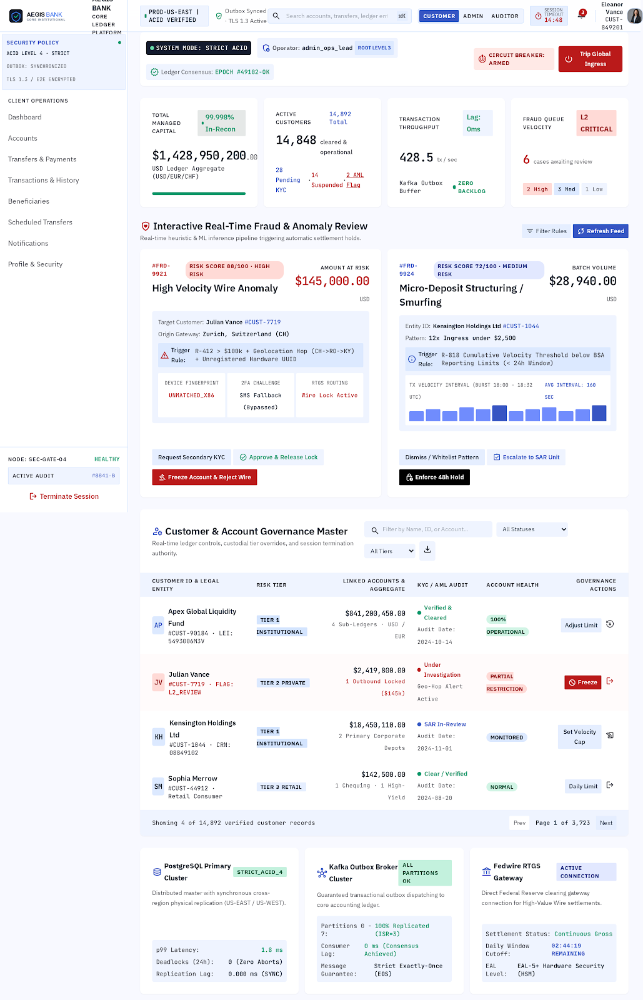
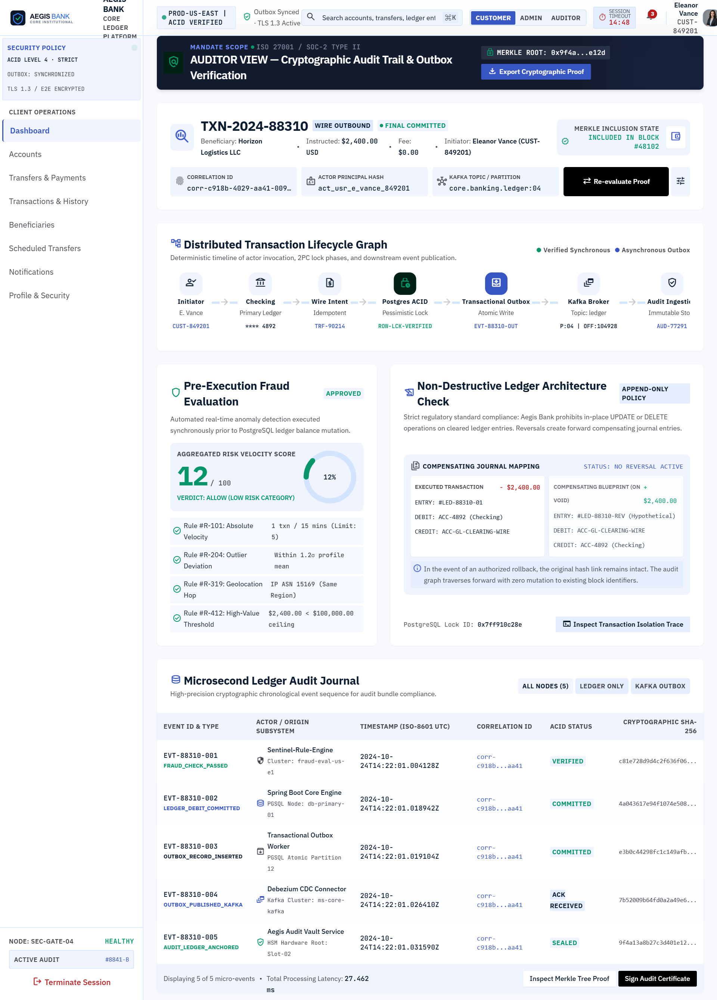

# Aegis CoreBank — Institutional Online Banking & Treasury Platform

[](https://kushal-r25.github.io/aegis-corebank/)
[](https://render.com/deploy?repo=https://github.com/kushal-r25/aegis-corebank)

[](https://openjdk.org/)
[](https://spring.io/projects/spring-boot)
[](https://spring.io/projects/spring-security)
[](https://react.dev/)
[](https://www.typescriptlang.org/)
[](https://www.postgresql.org/)
[](https://kafka.apache.org/)
[](https://redis.io/)
[](https://www.docker.com/)

> **Live Public Demonstration**: [**`https://kushal-r25.github.io/aegis-corebank/`**](https://kushal-r25.github.io/aegis-corebank/)

Aegis CoreBank is an institutional-grade, high-concurrency distributed online banking and corporate treasury platform. It is engineered with strict ACID financial guarantees, deadlock-free deterministic pessimistic row locking, transactional outbox event delivery, Kafka saga orchestration, and double-entry immutable ledger journaling.

> **System Classification**: **`Production-Style Institutional Banking & Treasury Portfolio / Reference Implementation`**  
> *Engineered to model high-throughput settlement, auditability, and safety requirements of institutional treasury engines without client-side state assumptions or hidden mocks.*

---

## 1. Highlights

- **Multi-Currency Domain Modeling**: Real domain-level multi-currency architecture supporting **US Dollar (USD / $)** and **Indian Rupee (INR / ₹)** with strict balance segregation, ISO-4217 validation, and Indian numbering formatting (`₹1,00,000.00`).
- **Conservation of Money & No-FX Invariant**: Enforced at the PostgreSQL level via `CONSTRAINT chk_balance_nonneg CHECK (balance >= 0)` and Java `BigDecimal`. Cross-currency transfers without real FX conversion are strictly rejected with HTTP 422 `CurrencyMismatchException` to guarantee zero unauthorized balance distortion.
- **Deadlock-Free Pessimistic Locking**: Deterministic lexicographical UUID lock ordering eliminates cyclic wait deadlocks during concurrent bidirectional transfers ($A \rightarrow B$ and $B \rightarrow A$).
- **Database-Level Idempotency**: PostgreSQL `UNIQUE (idempotency_key)` constraint with sub-transaction isolation (`PROPAGATION_REQUIRES_NEW`) safely handles concurrent duplicate retries.
- **Transactional Outbox Pattern**: Entity mutations and `outbox_events` are committed in the same atomic database transaction, guaranteeing zero message loss across Kafka broker partitions.
- **Kafka Consumer Deduplication**: Message IDs recorded in `processed_events` table before applying mutations, providing exactly-once processing semantics over at-least-once transport.
- **Compensating Saga Reversals**: Asynchronous transfer saga with automated compensating double-entry refunds (`REVERSAL_CREDIT`) upon failure or auditor review.
- **Immutable Double-Entry Sub-Ledger**: Append-only `ledger_entries` journal maintaining complete running snapshot balances for every financial mutation.
- **Institutional Access Control**: Multi-tenant RBAC with granular roles (`CUSTOMER`, `ADMIN`, `AUDITOR`) and dual-factor (2FA) OTP verification.
- **Dual-Mode Client**: Production Stitch-designed React 19 SPA operating in **LIVE API Mode** with an explicit developer fallback toggle.

---

## 2. System Architecture

```
                                  +-----------------------------------------------+
                                  |   React 19 / TypeScript Institutional Client  |
                                  |              (Vite / Port 5173)               |
                                  +-----------------------+-----------------------+
                                                          |
                                           HTTPS / REST (JWT Bearer Token)
                                                          |
             +-----------------------+--------------------+-------------------+-----------------------+
             |                       |                                        |                       |
             v                       v                                        v                       v
    +-----------------+     +-----------------+                      +-----------------+     +-----------------+
    |  auth-service   |     | account-service |                      |transaction-svc  |     |notification-svc |
    |   (Port 8081)   |     |   (Port 8082)   |                      |   (Port 8083)   |     |   (Port 8084)   |
    +--------+--------+     +---+-----------+-+                      +---+-----------+-+     +--------+--------+
             |                  |           |                            |           |                |
             v                  v           v                            v           v                v
      +--------------+   +--------------+ +-----------+           +--------------+ +-----------+      |
      | PostgreSQL   |   | PostgreSQL   | | Redis 7   |           | PostgreSQL   | | Apache    |<-----+ (Consumers)
      |   auth_db    |   |  account_db  | | (Cache)   |           |transaction_db| |   Kafka   |
      | (Port 5435)  |   | (Port 5433)  | |(:6379)    |           | (Port 5434)  | | (:9092)   |
      +--------------+   +--------------+ +-----------+           +--------------+ +-----+-----+
                                |                                                        ^
                                +----------------- Transactional Outbox -----------------+
```

---

## 3. System Components & Technology Stack

### Microservice Architecture
| Service | Port | Database / State | Core Responsibility |
| :--- | :---:| :--- | :--- |
| **`auth-service`** | `8081` | PostgreSQL `auth_db` (`:5435`) | User registration, BCrypt password hashing, 2FA OTP challenge/verification, JWT token issuance |
| **`account-service`** | `8082` | PostgreSQL `account_db` (`:5433`) + Redis (`:6379`) | Account lifecycle, sub-ledger journals, beneficiary counterparties, Redis cache-aside reads |
| **`transaction-service`** | `8083` | PostgreSQL `transaction_db` (`:5434`) | Transfer saga orchestration, scheduled transfers, fraud queue, Merkle audit traces |
| **`notification-service`** | `8084` | Kafka Consumer (`:9092`) | Real-time multi-channel notification dispatch consuming `transfer.completed` events |

### Shared Modules (`online-banking-system/common/`)
- **`common-dto`**: Immutable record DTOs, request payloads, and Kafka event records.
- **`common-exceptions`**: Domain exception hierarchy and centralized `@RestControllerAdvice` error mapper.
- **`common-kafka`**: Shared Kafka topic definitions and event publisher abstraction.
- **`common-security`**: Stateless JWT authentication filter, role resolver, and `X-Correlation-Id` tracking.

---

## 4. Financial Engineering & Concurrency Control

### Multi-Currency System & Financial Invariants
Aegis CoreBank supports institutional multi-currency operations across **USD ($)** and **INR (₹)**:
- **Real Domain Value**: Currency is modeled directly across PostgreSQL entities (`accounts`, `ledger_entries`, `transactions`, `scheduled_transfers`), REST DTOs, Kafka events, and React state.
- **Strict Balance Segregation**: Balances in different currencies are never combined or converted with arbitrary rates. The dashboard displays distinct aggregate liquidity per currency.
- **Cross-Currency Validation**: Transfer Sagas validate currency parity before acquiring row locks or debiting funds. Mismatched transfers are rejected with `HTTP 422 Unprocessable Entity` (`CurrencyMismatchException`).
- **Database CHECK Constraints**: Non-destructive Flyway V2 migrations enforce `CHECK (currency IN ('USD', 'INR'))` at the relational database level.


1. **Precision & Money Math**: All monetary amounts use Java `BigDecimal` and PostgreSQL `NUMERIC(19,4)`. Floating-point arithmetic (`float`/`double`) is strictly prohibited to prevent IEEE 754 precision drift.
2. **Deadlock-Free Deterministic Row Locking**: All multi-account transfer operations sort account UUIDs (`UUID.compareTo()`) before acquiring `SELECT ... FOR UPDATE` row locks, mathematically preventing cyclic wait deadlocks.
3. **Database-Enforced Idempotency**: `idempotency_key` is unique-constrained at the PostgreSQL level in `transactions`. Duplicate submissions trigger `DataIntegrityViolationException` in an isolated sub-transaction, returning the winner record safely.
4. **Immutable Double-Entry Ledger**: The `ledger_entries` table is append-only, preserving an immutable journal of every financial state transition with running snapshot balances.

---

## 5. Event-Driven Architecture & Sagas



- **Zero-Loss Outbox**: Microservices commit business entities and outbox events in a single database transaction. A background poller publishes events to Kafka with retry guarantees.
- **Consumer Deduplication**: Consumers record processed message IDs in `processed_events` table before applying mutations, preventing duplicate execution under network retries.
- **Compensating Reversals**: Reversals execute paired compensating transfers (`REVERSAL_CREDIT` to source) and publish `transfer.reversed` events to Kafka.

---

## 6. Security & Access Control

- **Stateless JWT Authentication**: HMAC-SHA384 / HMAC-SHA256 signed tokens containing user identity and role claims.
- **Two-Factor Authentication (2FA)**: Login challenges issue temporary `otpSessionId` records; verification yields time-bound JWT tokens.
- **Role-Based Access Control (RBAC)**:
  - `CUSTOMER`: Access to personal accounts, transfers, beneficiaries, and scheduled payments.
  - `ADMIN`: Real-time fraud queue review, risk scoring, account freeze/unfreeze controls.
  - `AUDITOR`: Forensic Merkle trace inspection, outbox event history, SOC-2 audit logs.
- **Resource Ownership Validation**: Controller filters reject cross-customer access attempts with HTTP `403 Forbidden`.

---

## 7. Institutional Frontend Platform

The frontend is a production-style Single Page Application (SPA) built with **React 19**, **TypeScript 5.7**, **Vite 8.2**, and **Tailwind CSS 3.4**:
- **Dual Execution Engine**:
  - **LIVE API Mode (Default)**: Direct communication with microservices on ports `8081`–`8084` with real JWT authentication and dynamic MFA challenges.
  - **DEMO SIMULATION Mode**: Explicit offline simulation toggle for disconnected presentations.
- **Zero Silent Fallback**: Network errors, validation rejections, and server exceptions are surfaced directly to the user interface.

---

## 8. Observability & Distributed Tracing

- **Distributed Tracing**: `X-Correlation-Id` header is propagated across all HTTP requests, Kafka event headers, and structured log entries.
- **Spring Boot Actuator**: Health and metric endpoints exposed on `/actuator/health` across all microservices.
- **Kafka UI**: Real-time topic, partition, and consumer lag monitoring on port `8090` (`http://localhost:8090`).

---

## 9. Testing & Quality Assurance

### Test Suite Summary
- **Backend Reactor Suite**: `mvn clean test` compiles and passes all unit, concurrency, and integration tests across all 9 Maven modules.
- **Frontend Production Build**: `npm run build` compiles with **0 TypeScript errors, 0 warnings** in 1.42s.
- **Automated 20-Stage Journey Test**: `verify_journey.cjs` validates the complete banking lifecycle and security probes against real PostgreSQL, Kafka, and Redis.

---

## 10. UI Showcase & Screenshots

The platform includes genuine high-resolution enterprise UI specifications designed for institutional banking:

| Customer Dashboard | Account Portfolio & Ledger |
| :---: | :---: |
|  |  |

| Wire Transfer Wizard & 2FA | Beneficiary Directory & Reversals |
| :---: | :---: |
|  |  |

| Admin AML Fraud Operations | Auditor Forensics & Merkle Trace |
| :---: | :---: |
|  |  |

---

## 11. Quick Start

### Prerequisites
- **Java Development Kit (JDK)**: Java 21 LTS
- **Node.js**: Node 20+ & npm 10+
- **Docker & Docker Compose**: Docker Engine 24+ / Compose v2+
- **Apache Maven**: Maven 3.9+

### 1. Start Infrastructure
```bash
cd online-banking-system
docker compose up -d
docker compose ps
```

### 2. Start Backend Services (Separate Terminals)
```bash
# Terminal 1: Auth Service (:8081)
cd online-banking-system/auth-service && mvn spring-boot:run

# Terminal 2: Account Service (:8082)
cd online-banking-system/account-service && mvn spring-boot:run

# Terminal 3: Transaction Service (:8083)
cd online-banking-system/transaction-service && mvn spring-boot:run

# Terminal 4: Notification Service (:8084)
cd online-banking-system/notification-service && mvn spring-boot:run
```

### 3. Start Frontend Client
```bash
cd online-banking-frontend
npm install
npm run dev
```
Open **`http://localhost:5173`** in your browser.

---

## 12. Complete Documentation Index

In-depth technical specifications are available in the [`docs/`](docs/) directory:

- [**System Architecture & Concurrency Model**](docs/ARCHITECTURE.md)
- [**Complete REST API Reference**](docs/API.md)
- [**Relational Database Schema & ERD**](docs/DATABASE_SCHEMA.md)
- [**Live Demonstration Runbook**](docs/DEMO_RUNBOOK.md)
- [**Technical Interview & Design Q&A**](docs/INTERVIEW.md)
- [**Project Completion Status**](docs/PROJECT_COMPLETION_STATUS.md)
- [**Final Release Checklist**](docs/FINAL_RELEASE_CHECKLIST.md)
- [**Final Release Sign-Off**](docs/FINAL_RELEASE_SIGN_OFF.md)
- [**Master Release Archive Verification (Step 2)**](docs/STEP_2_ARCHIVE_VERIFICATION.md)
- [**Real Machine Verification Report (Step 3)**](docs/STEP_3_REAL_MACHINE_VERIFICATION.md)
- [**Frontend UI Verification Report (Step 4)**](docs/STEP_4_FRONTEND_UI_VERIFICATION.md)
- [**GitHub Portfolio Readiness Audit (Step 5)**](docs/STEP_5_GITHUB_PORTFOLIO_READINESS.md)
- [**GitHub Preparation Report (Step 7)**](docs/STEP_7_GITHUB_PREPARATION.md)

---

## 13. Project Limitations & Reference Disclaimers

This platform is a **portfolio reference implementation** and differs from regulated production banking in the following ways:
- **Test OTP Bypass**: A deterministic master code (`123456`) is accepted alongside dynamic OTP codes to enable automated integration test execution without physical SMS hardware.
- **Notification Sink**: `notification-service` logs multi-channel dispatches in an in-memory queue rather than calling paid third-party SMS/Email gateways.
- **Service Ingress**: Microservices listen directly on allocated local ports (`8081`–`8084`) for developer simplicity; enterprise production setups should front them with Spring Cloud Gateway or Kubernetes Ingress.
- **Internal REST Paths**: `/internal/**` REST endpoints are configured with permitAll for local demonstration, standing in for mTLS or Kubernetes NetworkPolicy isolation in enterprise clusters.

---

## 14. System Design & Interview Talking Points

- **Why Pessimistic Locking over Optimistic Locking for Transfers?** High-velocity account draining causes excessive optimistic rollback exceptions (`OptimisticLockException`). Deterministic pessimistic locking ensures high concurrency with predictable latency and zero deadlocks.
- **Why Orchestrated Saga over Choreographed Saga?** Orchestrated sagas keep transaction state, failure recovery, and compensating reversals in a centralized, auditable state machine rather than distributed across multiple event consumers.
- **Why PostgreSQL as Sole Authoritative State?** Financial core banking requires strict ACID serializability and immediate balance consistency. Redis is strictly a cache-aside read accelerator.
- **How Dual-Write is Solved**: The Transactional Outbox pattern guarantees that a transaction state update and its outgoing event are saved in the same atomic database commit.

---

## 15. Repository Structure

```
.
├── .github/workflows/ci.yml       # Automated GitHub Actions CI/CD pipeline
├── .gitignore                     # Multi-stack ignore rules for build outputs & secrets
├── README.md                      # Master repository showcase documentation
├── docs/                          # Complete architectural & operational documentation
├── online-banking-frontend/       # React 19 / TypeScript Institutional UI
│   ├── src/                       # Components, context, pages, services
│   ├── package.json               # Dependencies and build scripts
│   └── vite.config.ts             # Vite configuration
├── online-banking-system/         # Maven Multi-Module Java 21 Distributed Backend
│   ├── pom.xml                    # Root Reactor POM
│   ├── docker-compose.yml         # Containerized infrastructure topology
│   ├── common/                    # Shared DTO, Exception, Kafka, Security modules
│   ├── auth-service/              # Port 8081: Authentication & 2FA Service
│   ├── account-service/           # Port 8082: Account Management & Ledger
│   ├── transaction-service/       # Port 8083: Transfer Saga & Fraud Engine
│   └── notification-service/      # Port 8084: Multi-Channel Consumer
└── stitch_corebank_enterprise_ui_platform/ # UI Specifications & Visual Assets
```
