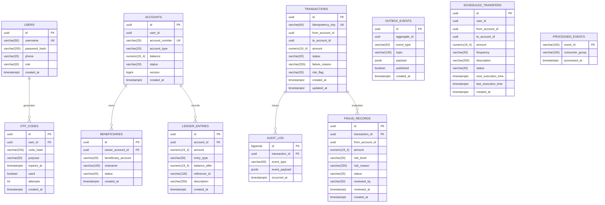

# Aegis CoreBank Database Schema Specification

This document details the complete relational database architecture for PostgreSQL 17 across all Aegis CoreBank microservices.

---

## 1. Relational Entity Relationship Diagram

---

## 2. Service Database Breakdown

### 2.1 `auth_db` (Auth Service)

#### Table: `users`
Authoritative user identity records.
| Column | Type | Constraints | Description |
| :--- | :--- | :--- | :--- |
| `id` | `UUID` | `PRIMARY KEY DEFAULT gen_random_uuid()` | Immutable user ID |
| `username` | `VARCHAR(50)` | `UNIQUE NOT NULL` | Unique login username |
| `password_hash` | `VARCHAR(255)` | `NOT NULL` | BCrypt/Argon2 password hash |
| `phone` | `VARCHAR(20)` | `NULL` | E.164 phone number for SMS OTP |
| `role` | `VARCHAR(20)` | `NOT NULL DEFAULT 'CUSTOMER'` | RBAC role (`CUSTOMER`, `ADMIN`, `AUDITOR`) |
| `created_at` | `TIMESTAMPTZ` | `NOT NULL DEFAULT now()` | Registration timestamp |

#### Table: `otp_codes`
Transient two-factor authentication challenge codes.
| Column | Type | Constraints | Description |
| :--- | :--- | :--- | :--- |
| `id` | `UUID` | `PRIMARY KEY DEFAULT gen_random_uuid()` | OTP session identifier |
| `user_id` | `UUID` | `NOT NULL REFERENCES users(id)` | Foreign key to target user |
| `code_hash` | `VARCHAR(255)` | `NOT NULL` | One-way hash of 6-digit OTP code |
| `purpose` | `VARCHAR(30)` | `NOT NULL` | Challenge purpose (e.g. `LOGIN`, `WIRE_TRANSFER`) |
| `expires_at` | `TIMESTAMPTZ` | `NOT NULL` | Absolute expiry cutoff (default: +5m) |
| `used` | `BOOLEAN` | `NOT NULL DEFAULT false` | Single-use invalidation flag |
| `attempts` | `INT` | `NOT NULL DEFAULT 0` | Failed verification attempts |
| `created_at` | `TIMESTAMPTZ` | `NOT NULL DEFAULT now()` | Code generation timestamp |

**Indexes**:
- `CREATE INDEX idx_otp_user_id ON otp_codes(user_id);`

---

### 2.2 `account_db` (Account Service)

#### Table: `accounts`
Core vault and bank accounts holding authoritative balances.
| Column | Type | Constraints | Description |
| :--- | :--- | :--- | :--- |
| `id` | `UUID` | `PRIMARY KEY DEFAULT gen_random_uuid()` | Unique account identifier |
| `user_id` | `UUID` | `NOT NULL` | Owning customer/institution user ID |
| `account_number`| `VARCHAR(20)` | `UNIQUE NOT NULL` | Public routing account number (`ACC-...`) |
| `account_type` | `VARCHAR(20)` | `NOT NULL` | `CHECKING`, `SAVINGS`, `TREASURY`, `ESCROW` |
| `balance` | `NUMERIC(19,4)`| `NOT NULL DEFAULT 0, CHECK (balance >= 0)` | Authoritative balance; cannot be negative |
| `status` | `VARCHAR(20)` | `NOT NULL DEFAULT 'ACTIVE'` | `ACTIVE`, `FROZEN`, `CLOSED` |
| `version` | `BIGINT` | `NOT NULL DEFAULT 0` | Optimistic locking version |
| `created_at` | `TIMESTAMPTZ` | `NOT NULL DEFAULT now()` | Vault opening timestamp |

**Indexes**:
- `CREATE INDEX idx_accounts_user_id ON accounts(user_id);`

#### Table: `beneficiaries`
Counterparty payees configured for rapid wire execution.
| Column | Type | Constraints | Description |
| :--- | :--- | :--- | :--- |
| `id` | `UUID` | `PRIMARY KEY DEFAULT gen_random_uuid()` | Beneficiary record ID |
| `owner_account_id` | `UUID` | `NOT NULL REFERENCES accounts(id)` | Owning source account |
| `beneficiary_account` | `VARCHAR(20)` | `NOT NULL` | Target destination account number |
| `nickname` | `VARCHAR(100)` | `NULL` | Alias label |
| `status` | `VARCHAR(20)` | `NOT NULL DEFAULT 'ACTIVE'` | `ACTIVE`, `BLOCKED` |
| `created_at` | `TIMESTAMPTZ` | `NOT NULL DEFAULT now()` | Association timestamp |

**Constraints**:
- `UNIQUE (owner_account_id, beneficiary_account)`

#### Table: `ledger_entries`
Immutable double-entry sub-ledger journal recording all mutations.
| Column | Type | Constraints | Description |
| :--- | :--- | :--- | :--- |
| `id` | `UUID` | `PRIMARY KEY DEFAULT gen_random_uuid()` | Unique ledger entry ID |
| `account_id` | `UUID` | `NOT NULL REFERENCES accounts(id)` | Impacted account |
| `amount` | `NUMERIC(19,4)`| `NOT NULL` | Signed transaction delta (+credit, -debit) |
| `entry_type` | `VARCHAR(30)` | `NOT NULL` | `CREDIT`, `DEBIT`, `TRANSFER_OUT`, `TRANSFER_IN` |
| `balance_after`| `NUMERIC(19,4)`| `NOT NULL` | Post-mutation snapshot balance |
| `reference_id` | `VARCHAR(100)` | `NULL` | Linked transaction/wire identifier |
| `description` | `VARCHAR(255)` | `NULL` | Memo description |
| `created_at` | `TIMESTAMPTZ` | `NOT NULL DEFAULT now()` | Commit timestamp |

**Indexes**:
- `CREATE INDEX idx_ledger_account_id ON ledger_entries(account_id);`
- `CREATE INDEX idx_ledger_created_at ON ledger_entries(created_at);`

---

### 2.3 `transaction_db` (Transaction Service)

#### Table: `transactions`
Lifecycle state and lineage of all transfer sagas.
| Column | Type | Constraints | Description |
| :--- | :--- | :--- | :--- |
| `id` | `UUID` | `PRIMARY KEY DEFAULT gen_random_uuid()` | Global transaction ID |
| `idempotency_key`| `VARCHAR(64)` | `UNIQUE NOT NULL` | Client idempotency token |
| `from_account_id`| `UUID` | `NOT NULL` | Debited source account |
| `to_account_id` | `UUID` | `NOT NULL` | Credited destination account |
| `amount` | `NUMERIC(19,4)`| `NOT NULL CHECK (amount > 0)` | Wire amount (strictly positive) |
| `status` | `VARCHAR(20)` | `NOT NULL` | `PENDING`, `COMPLETED`, `FAILED`, `REVERSED` |
| `failure_reason`| `VARCHAR(255)`| `NULL` | Rejection or failure detail |
| `risk_flag` | `VARCHAR(20)` | `NULL` | `LOW`, `MEDIUM`, `HIGH` |
| `created_at` | `TIMESTAMPTZ` | `NOT NULL DEFAULT now()` | Creation timestamp |
| `updated_at` | `TIMESTAMPTZ` | `NOT NULL DEFAULT now()` | Status update timestamp |

**Indexes**:
- `CREATE INDEX idx_txn_from_account ON transactions(from_account_id);`
- `CREATE INDEX idx_txn_to_account ON transactions(to_account_id);`
- `CREATE INDEX idx_txn_status ON transactions(status);`

#### Table: `outbox_events`
Transactional outbox ensuring zero message loss to Apache Kafka.
| Column | Type | Constraints | Description |
| :--- | :--- | :--- | :--- |
| `id` | `UUID` | `PRIMARY KEY DEFAULT gen_random_uuid()` | Unique outbox event ID |
| `aggregate_id` | `UUID` | `NOT NULL` | Correlated domain entity ID |
| `event_type` | `VARCHAR(50)` | `NOT NULL` | Event class/type name |
| `topic` | `VARCHAR(100)`| `NOT NULL` | Destination Kafka topic |
| `payload` | `JSONB` | `NOT NULL` | Serialized event payload |
| `published` | `BOOLEAN` | `NOT NULL DEFAULT false` | Dispatch confirmation flag |
| `created_at` | `TIMESTAMPTZ` | `NOT NULL DEFAULT now()` | Enqueue timestamp |

**Partial Index**:
- `CREATE INDEX idx_outbox_unpublished ON outbox_events(published) WHERE published = false;`

#### Table: `scheduled_transfers`
Recurring automated wire schedules.
| Column | Type | Constraints | Description |
| :--- | :--- | :--- | :--- |
| `id` | `UUID` | `PRIMARY KEY DEFAULT gen_random_uuid()` | Standing order schedule ID |
| `user_id` | `UUID` | `NOT NULL` | Owning customer ID |
| `from_account_id`| `UUID` | `NOT NULL` | Source account |
| `to_account_id` | `UUID` | `NOT NULL` | Destination account |
| `amount` | `NUMERIC(19,4)`| `NOT NULL CHECK (amount > 0)` | Transfer amount |
| `frequency` | `VARCHAR(20)` | `NOT NULL` | `DAILY`, `WEEKLY`, `MONTHLY` |
| `description` | `VARCHAR(255)`| `NULL` | Standing wire note |
| `status` | `VARCHAR(20)` | `NOT NULL DEFAULT 'ACTIVE'` | `ACTIVE`, `PAUSED`, `CANCELLED` |
| `next_execution_time`| `TIMESTAMPTZ`| `NOT NULL` | Next trigger schedule |
| `last_execution_time`| `TIMESTAMPTZ`| `NULL` | Last completed execution |
| `created_at` | `TIMESTAMPTZ` | `NOT NULL DEFAULT now()` | Schedule creation timestamp |

**Indexes**:
- `CREATE INDEX idx_scheduled_next ON scheduled_transfers(next_execution_time, status);`

#### Table: `fraud_records`
Flagged suspicious transactions for AML compliance review.
| Column | Type | Constraints | Description |
| :--- | :--- | :--- | :--- |
| `id` | `UUID` | `PRIMARY KEY DEFAULT gen_random_uuid()` | Fraud incident record ID |
| `transaction_id`| `UUID` | `NOT NULL REFERENCES transactions(id)`| Flagged transaction |
| `from_account_id`| `UUID` | `NOT NULL` | Debited account under review |
| `amount` | `NUMERIC(19,4)`| `NOT NULL` | Flagged transfer amount |
| `risk_level` | `VARCHAR(20)` | `NOT NULL` | `LOW`, `MEDIUM`, `HIGH` |
| `risk_reason` | `VARCHAR(255)`| `NOT NULL` | AML heuristic flag rationale |
| `status` | `VARCHAR(20)` | `NOT NULL DEFAULT 'PENDING'`| `PENDING`, `APPROVED`, `REJECTED` |
| `reviewed_by` | `VARCHAR(50)` | `NULL` | Admin reviewer username |
| `reviewed_at` | `TIMESTAMPTZ` | `NULL` | Review decision timestamp |
| `created_at` | `TIMESTAMPTZ` | `NOT NULL DEFAULT now()` | Incident creation timestamp |

**Indexes**:
- `CREATE INDEX idx_fraud_status ON fraud_records(status);`

#### Table: `audit_log`
Immutable forensic audit trail for every saga step.
| Column | Type | Constraints | Description |
| :--- | :--- | :--- | :--- |
| `id` | `BIGSERIAL` | `PRIMARY KEY` | Monotonic audit sequence number |
| `transaction_id`| `UUID` | `NOT NULL REFERENCES transactions(id)`| Correlated transaction |
| `event_type` | `VARCHAR(50)` | `NOT NULL` | Lifecycle state transition |
| `event_payload`| `JSONB` | `NULL` | Forensic metadata payload |
| `occurred_at` | `TIMESTAMPTZ` | `NOT NULL DEFAULT now()` | Timestamp |

#### Table: `processed_events`
Consumer deduplication table preventing at-least-once duplicate processing.
| Column | Type | Constraints | Description |
| :--- | :--- | :--- | :--- |
| `event_id` | `VARCHAR(100)`| `PRIMARY KEY` | Unique Kafka message key / saga event ID |
| `consumer_group`| `VARCHAR(100)`| `NOT NULL` | Consumer group identifier |
| `processed_at`| `TIMESTAMPTZ` | `NOT NULL DEFAULT now()` | Completion timestamp |

---

## 3. Financial Invariants & Concurrency Design

1. **Monetary Precision**: All currency balances and transfers use PostgreSQL `NUMERIC(19,4)` and Java `BigDecimal`. Floating-point types (`FLOAT`, `DOUBLE`) are strictly forbidden.
2. **Deterministic Locking**: Deadlocks during concurrent bidirectional transfers ($A \rightarrow B$ and $B \rightarrow A$) are prevented by sorting primary key UUIDs in ascending order before executing `SELECT ... FOR UPDATE`.
3. **Double-Entry Immutability**: Ledger rows are strictly append-only. Compensations are executed by creating inverse `CREDIT` entries rather than altering historic rows.
