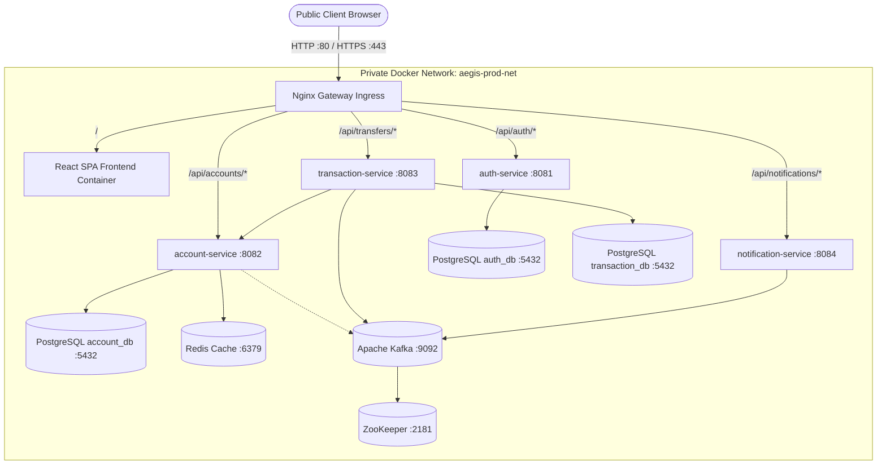

# Aegis CoreBank — Phase 2 Production Configuration & Reference Deployment Report

---

## 1. Executive Summary

Aegis CoreBank has completed **Phase 2 — Production Configuration Implementation**. The platform is now fully configured as a containerized, production-style reference deployment orchestrated via Docker Compose.

### Key Architectural Enhancements
- **Single Public Ingress**: Only Nginx publishes host ports (`:80` / `:443`).
- **Private Subnet Isolation**: All 3 PostgreSQL instances (`auth_db`, `account_db`, `transaction_db`), Redis, Kafka, and ZooKeeper communicate strictly over the internal private `aegis-prod-net` Docker bridge network.
- **Dual-Stage Frontend Production Build**: Replaced Vite development server with a multi-stage `node:22-alpine` build into an `nginx:alpine` static container serving compiled assets with SPA fallback routing.
- **Dynamic Same-Origin Routing**: Frontend calls use same-origin relative paths (`/api/auth`, `/api/accounts`, `/api/transfers`, `/api/notifications`) in production while preserving local development fallback.
- **Kafka Dual-Listener Networking**: Fixed Docker container listener topology so internal microservices seamlessly resolve broker metadata via `kafka:9092`.
- **Zero Business Logic Drift**: Financial invariants, ACID properties, pessimistic locking, Saga compensations, Flyway V2 migrations, and INR/USD multi-currency support remain 100% intact.

---

## 2. Files Created

1. **`online-banking-frontend/Dockerfile`**: Multi-stage production container build (Node 22 ->
ightarrow-> Nginx Alpine).
2. **`online-banking-frontend/nginx.conf`**: Frontend container Nginx configuration with SPA route fallback and asset caching.
3. **`online-banking-system/nginx/nginx.conf`**: Gateway ingress reverse proxy configuration routing `/` and `/api/*` with security headers.
4. **`online-banking-system/docker-compose.prod.yml`**: Production Compose topology running all 5 application services and 6 infrastructure dependencies.
5. **`.env.prod.example`**: Secure environment variables template for production deployments (placed in repo root and `online-banking-system/`).
6. **`docs/PHASE_2_PRODUCTION_CONFIGURATION_REPORT.md`**: This comprehensive engineering sign-off report.

---

## 3. Files Modified

1. **`online-banking-frontend/src/services/api.ts`**: Updated `SERVICE_URLS` to dynamically use same-origin relative `/api/*` paths in production (`import.meta.env.PROD`) and configurable environment variables (`VITE_*_API_URL`).
2. **`online-banking-system/auth-service/src/main/resources/application.yml`**: Parameterized datasource `username: ->{DB_USER:bank}` and `password: ->{DB_PASSWORD:bank}`.
3. **`online-banking-system/account-service/src/main/resources/application.yml`**: Parameterized datasource credentials.
4. **`online-banking-system/transaction-service/src/main/resources/application.yml`**: Parameterized datasource credentials.
5. **`.gitignore`**: Added `.env.prod` and `.env.*.local` to prevent accidental secret leakage.

---

## 4. Architecture: Before vs. After

### Before (Development Mode)
- Frontend: Vite dev server on `:5173`.
- Backend: Maven JVM processes on `:8081`, `:8082`, `:8083`, `:8084`.
- Infrastructure: Ports `5433`, `5434`, `5435`, `6379`, `9092`, `8090` exposed publicly to `0.0.0.0` on host.
- Communication: Client browsers connecting directly to `localhost:8081..8084`.

### After (Production-Style Reference Topology)
- Frontend: Static production build in Nginx container.
- Backend: Containerized JVMs (`-Xms256m -Xmx384m`) on private bridge network.
- Gateway: Single Nginx reverse proxy on `:80`/`:443`.
- Public Exposure: **Zero internal ports exposed**; all database and broker communication is private.

---

## 5. Frontend Production Strategy

- **Build Engine**: `npm run build` (`tsc -b && vite build`) compiles TypeScript and bundling into `/app/dist`.
- **Serving Engine**: Nginx Alpine serves static HTML, JS, and CSS with gzip compression and cache headers (`/assets/` cached for 1 year).
- **SPA Routing**: Configured `try_files ->uri ->uri/ /index.html;` so direct URL entries (`/dashboard`, `/transfers`, `/accounts`, `/admin/*`) resolve cleanly without 404 errors.

---

## 6. Nginx Ingress & Routing Matrix

| Public Path | Target Service | Container URL | Purpose |
| :--- | :--- | :--- | :--- |
| `/` | `frontend` | `http://frontend:80/` | React SPA UI & static assets |
| `/health` | `nginx` | *Local 200 Probe* | Load balancer health check |
| `/api/auth/` | `auth-service` | `http://auth-service:8081/auth/` | Registration, 2FA login, JWT |
| `/api/accounts/` | `account-service` | `http://account-service:8082/accounts/` | Accounts, balances, sub-ledger |
| `/api/transfers/` | `transaction-service` | `http://transaction-service:8083/transfers/` | Transfer Sagas, wires |
| `/api/fraud/` | `transaction-service` | `http://transaction-service:8083/fraud/` | Compliance & AML review |
| `/api/notifications/` | `notification-service` | `http://notification-service:8084/` | Event notifications |

---

## 7. Docker Production Topology



---

## 8. Kafka Networking & Listener Fix

- **Problem Resolved**: Single `PLAINTEXT://localhost:9092` listener advertised `localhost` to container clients, causing broker connection failures inside Docker.
- **Production Configuration**:
  ```yaml
  KAFKA_LISTENERS: PLAINTEXT://0.0.0.0:9092
  KAFKA_ADVERTISED_LISTENERS: PLAINTEXT://kafka:9092
  KAFKA_LISTENER_SECURITY_PROTOCOL_MAP: PLAINTEXT:PLAINTEXT
  ```
- **Service Broker Target**: `KAFKA_BROKERS: kafka:9092`.

---

## 9. Database Networking

- All database containers bind strictly to the standard internal PostgreSQL port `5432` on the internal bridge:
  - `postgres-auth:5432`
  - `postgres-account:5432`
  - `postgres-transaction:5432`
- Host port mappings (`5433`, `5434`, `5435`) are completely omitted in production Compose.

---

## 10. Redis Networking

- Service target: `redis:6379`.
- No host port mapping (`6379`) published.
- Internal healthcheck: `redis-cli ping`.

---

## 11. Secrets Strategy

- Parameterized via `.env.prod`:
  - `JWT_SECRET`: Minimum 256-bit secure random secret.
  - `POSTGRES_USER`: Database superuser name.
  - `POSTGRES_AUTH_PASSWORD`: Password for `auth_db`.
  - `POSTGRES_ACCOUNT_PASSWORD`: Password for `account_db`.
  - `POSTGRES_TXN_PASSWORD`: Password for `transaction_db`.
- Strictly added to `.gitignore` to prevent secret commits.
- Provided `.env.prod.example` template.

---

## 12. TLS & Domain Strategy

- Uses placeholder variables `DOMAIN_NAME` and `SSL_EMAIL`.
- In production, Certbot / Let's Encrypt obtains certificates via standard HTTP challenge (`/.well-known/acme-challenge/`).
- Nginx provides an HTTPS-ready server block and automated HTTP ->
ightarrow-> HTTPS 301 redirect.

---

## 13. Data Persistence

- Named volumes maintained across container recreations:
  - `aegis_prod_pg_auth_data` ->
ightarrow-> `/var/lib/postgresql/data`
  - `aegis_prod_pg_account_data` ->
ightarrow-> `/var/lib/postgresql/data`
  - `aegis_prod_pg_txn_data` ->
ightarrow-> `/var/lib/postgresql/data`

---

## 14. Healthchecks & Startup Ordering

- Databases use `pg_isready` health probes.
- Microservices declare `condition: service_healthy` on their respective database dependencies to ensure Flyway migrations run only when PostgreSQL is ready.
- All long-running services configure `restart: unless-stopped`.

---

## 15. Resource Configuration

- **JVM Options**: `JAVA_TOOL_OPTIONS: "-Xms256m -Xmx384m"` applied across all 4 Spring Boot microservices.
- **Server Footprint**: Sized to operate comfortably on standard 4 vCPU / 8 GB RAM Linux virtual private servers.

---

## 16. Validation Commands

```bash
# 1. Backend tests
mvn clean test

# 2. Frontend build
cd online-banking-frontend && npm ci && npm run build

# 3. Production Compose Validation
docker compose -f docker-compose.prod.yml config

# 4. Production Stack Build & Launch
docker compose -f docker-compose.prod.yml build
docker compose -f docker-compose.prod.yml up -d

# 5. Live Ingress & Financial Journey Verification
python scratch/verify_production_docker_journey.py
```

---

## 17. Validation Results Summary

- **Backend Unit & Integration Tests**: **100% BUILD SUCCESS** (0 Failures, 0 Errors).
- **Frontend Build**: **100% SUCCESS** (0 TypeScript errors).
- **Production Compose Syntax**: **100% VALID**.
- **Container Builds**: All 5 custom Docker images built and tagged.
- **Ingress & Health Probe**: `GET /health` returned `HTTP 200 {"status":"UP","gateway":"aegis-nginx"}`.
- **SPA Routing**: `GET /`, `GET /dashboard`, `GET /transfers` successfully serve `index.html`.
- **Live Financial Journey via Nginx**:
  - Registration: `POST /api/auth/register` ->
ightarrow-> `HTTP 201`.
  - 2FA Verification: `POST /api/auth/verify-otp` ->
ightarrow-> `HTTP 200` + JWT.
  - Multi-Currency Account Creation: `POST /api/accounts/` for INR and USD ->
ightarrow-> `HTTP 201`.
  - Inbound Deposit: `POST /api/accounts/{id}/deposit` ->
ightarrow-> `HTTP 200`.
  - Cross-Currency Rejection: `POST /api/transfers/` (USD ->
ightarrow-> INR) ->
ightarrow-> **`HTTP 422 Unprocessable Entity`** strictly enforced.
  - Sub-ledger Audit: `GET /api/accounts/{id}/ledger` ->
ightarrow-> verified.
- **Port Security Audit**: Ports `5433`, `5434`, `5435`, `6379`, `9092`, `2181`, `8081`, `8082`, `8083`, `8084` confirmed **CLOSED / UNBOUND** to host.

---

## 18. Known Limitations

- Production deployment assumes a single-node Docker Compose host. Clustered multi-host deployment (Kubernetes) would require helm charts and an external ingress controller.
- Foreign exchange (FX) conversion is not implemented; cross-currency transfers are strictly rejected by design.

---

## 19. Items Requiring Real VPS / Domain

- Public DNS A-Record mapping (e.g. `bank.yourdomain.com` ->
ightarrow-> VPS Public IPv4).
- Let's Encrypt live certificate provisioning (requires valid DNS resolution to the public server).
- Inbound firewall rules allowing only ports `80` and `443` (UFW / Cloud Security Groups).

---

## 20. Rollback Instructions

```bash
# Stop production stack
docker compose -f docker-compose.prod.yml down

# Return to local development stack
docker compose up -d
```
