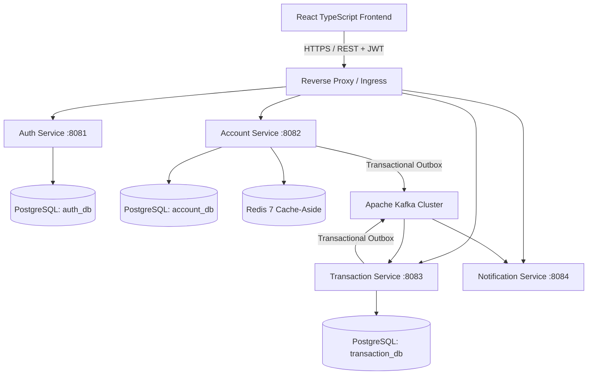
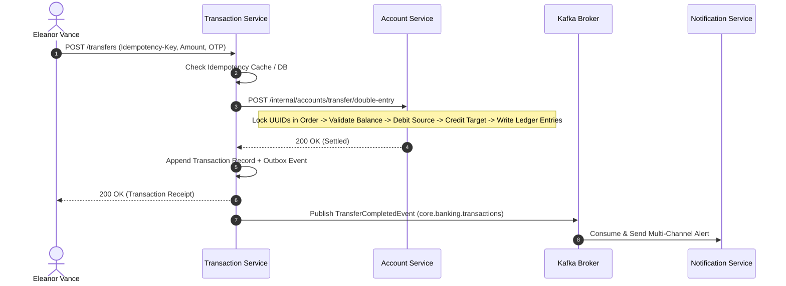

# Aegis CoreBank Enterprise Architecture Specification

## 1. Executive Summary & Design Principles

Aegis CoreBank is an production-grade, high-concurrency Indian digital banking platform built with Java 21, Spring Boot 3.5+, Apache Kafka, Redis 7, and PostgreSQL 17. The system is engineered to guarantee strict **ACID transactional integrity**, **deterministic concurrency control**, **immutable double-entry ledger journals**, and **zero-loss event-driven integration**.

### Core Tenets
1. **PostgreSQL as Sole Authoritative State**: Every balance mutation, ledger entry, outbox record, and saga execution is atomically committed to PostgreSQL.
2. **Immutable Double-Entry Accounting**: Financial records are never updated or deleted. Reversals and adjustments produce paired offsetting debit/credit entries with complete correlation lineage.
3. **Deadlock-Free Deterministic Row Locking**: All multi-account transfer operations sort account UUIDs before acquiring `SELECT ... FOR UPDATE` row locks, mathematically preventing circular wait conditions.
4. **Transactional Outbox Pattern**: Dual-writes to databases and message brokers are strictly prohibited. Microservices commit business entities and outbox events in a single database transaction.
5. **Idempotent Kafka Consumers**: All downstream consumers maintain deduplication tables (`processed_events`) with unique message IDs.
6. **Defense-in-Depth Security**: Stateless JWTs with HMAC-SHA256 signatures, correlation tracking via `X-Correlation-Id`, and role-based access control (`CUSTOMER`, `ADMIN`, `AUDITOR`).

---

## 2. Microservice Topology



---

## 3. Concurrency Control & Deadlock Elimination

### Deterministic UUID Ordering
When executing transfers between Account A and Account B:
```java
UUID firstId = sourceId.compareTo(targetId) < 0 ? sourceId : targetId;
UUID secondId = sourceId.compareTo(targetId) < 0 ? targetId : sourceId;

Account firstAcc = accountRepository.findByIdForUpdate(firstId);
Account secondAcc = accountRepository.findByIdForUpdate(secondId);
```
This guarantees that concurrent transfers in opposite directions ($A \rightarrow B$ and $B \rightarrow A$) acquire locks in the exact same sequence, eliminating PostgreSQL transaction deadlocks.

---

## 4. Distributed Saga Orchestration & Paired Reversals



### Compensating Double-Entry Reversal
When an admin or auditor initiates a reversal:
1. The original transaction is verified and marked `REVERSED`.
2. A compensating transaction is executed with inverted double entries (`CREDIT` to source account).
3. A `TRANSFER_REVERSED` event is emitted onto `core.banking.transfer.reversed` for audit trail tracking.

---

## 5. Security Architecture & RBAC Matrix

| Role | Scope & Permissions | Permitted Routes |
| :--- | :--- | :--- |
| **CUSTOMER** | View own vaults, execute transfers, manage beneficiaries, schedule recurring payments. | `/dashboard`, `/accounts`, `/transfers`, `/beneficiaries`, `/scheduled-transfers`, `/transactions` |
| **ADMIN** | Real-time fraud queue review, risk scoring, trip circuit breaker, override account locks. | `/admin`, `/accounts`, `/transactions`, `/beneficiaries`, `/security` |
| **AUDITOR** | Cryptographic Merkle trace inspection, Kafka event stream examination, SOC-2 proof export. | `/auditor`, `/transactions`, `/accounts`, `/security` |
